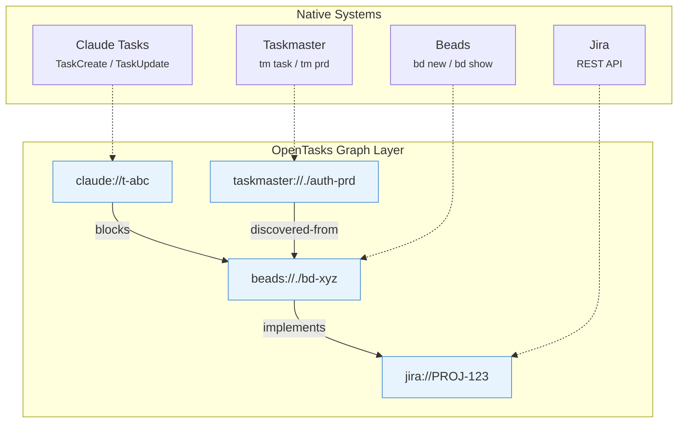
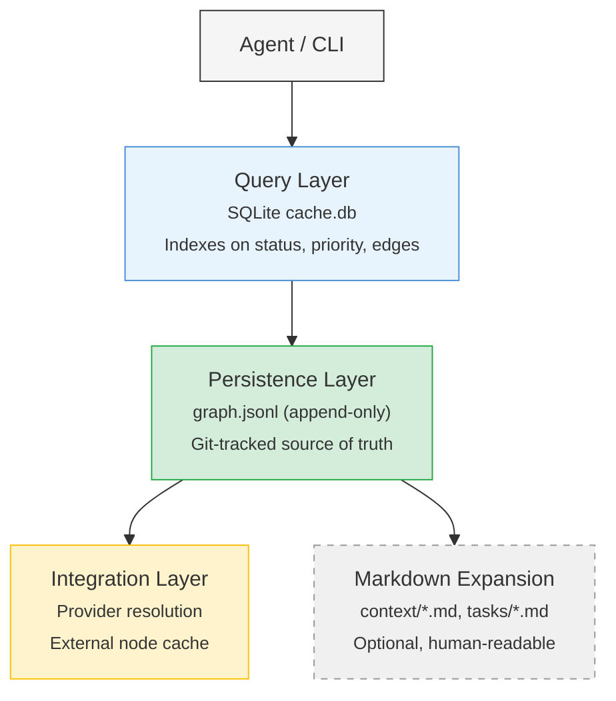
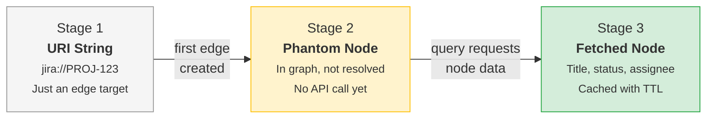
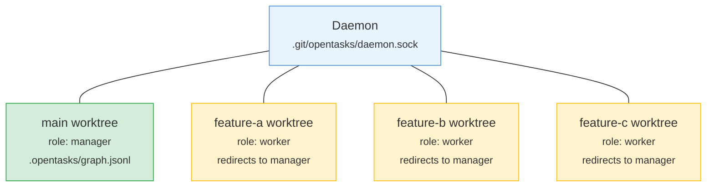

# OpenTasks

Cross-system graph for tasks and specs. Link Claude Tasks to Beads issues to Jira tickets. Query blockers and ready work across all of them.

```
npm install opentasks
```

## Quick Start

```typescript
import { link, query, annotate } from 'opentasks'

// Connect a Beads issue to a Jira ticket
await link({
  fromId: 't-x7k9',
  toId: 'jira://PROJ-123',
  type: 'blocks',
})

// What's ready to work on?
const ready = await query({ ready: {} })

// What blocks this task?
const blockers = await query({
  blockers: { nodeId: 't-x7k9', transitive: true },
})

// Leave feedback on a context
await annotate({
  targetId: 'c-a2b3',
  create: {
    content: 'Needs error handling for token refresh',
    type: 'suggestion',
    anchor: { text: 'OAuth2 with PKCE' },
  },
})
```

## The Problem

Claude Tasks, Beads, Jira, Linear, Taskmaster each manage their own content. None of them can express cross-system relationships. You cannot say "this Claude subtask implements that Beads issue" or "this Beads issue is blocked by that Jira ticket."

OpenTasks adds edges between them.



You keep using each system's native tools. OpenTasks owns the graph.

## Three Tools

### link()

Create or remove edges between any nodes.

```typescript
await link({ fromId: 't-x7k9', toId: 'c-a2b3', type: 'implements' })
await link({ fromId: 't-setup', toId: 't-impl', type: 'blocks' })
await link({ fromId: 't-setup', toId: 't-impl', type: 'blocks', remove: true })
```

Edge types: `blocks` (cycle-checked), `implements`, `references`, `related`, `parent-of`, `depends-on`, `discovered-from`, `duplicates`, `supersedes`. Add custom types as strings.

### query()

Search nodes, edges, and computed views.

```typescript
await query({ ready: {} })                                        // Unblocked open tasks
await query({ blockers: { nodeId: 't-impl' } })                  // Direct blockers
await query({ blockers: { nodeId: 't-impl', transitive: true }}) // Full blocker chain
await query({ nodes: { type: 'task', status: 'open' } })        // Filter nodes
await query({ feedback: { nodeId: 'c-auth' } })                  // Feedback on a context
```

### annotate()

Feedback with anchoring, threading, and resolution.

```typescript
// Comment anchored to a line
await annotate({
  targetId: 'c-spec',
  create: {
    content: 'Consider rate limiting here',
    type: 'suggestion',
    anchor: { line: 42 },
  },
})

// Resolve feedback
await annotate({ targetId: 'c-spec', resolve: 'f-c4d5' })
```

Types: `comment`, `suggestion`, `request`. Each can be resolved, dismissed, or reopened.

## Nodes

Four types, all stored in `.opentasks/graph.jsonl`:

| Type | Prefix | Purpose |
|------|--------|---------|
| Spec | s- | Requirements, context, user intent |
| Task | i- | Actionable work with status (open / in_progress / blocked / closed) |
| Feedback | f- | Anchored comments on nodes, with threading |
| ExternalNode | e- | References to Jira, Beads, Linear, GitHub |

A typical feature graph looks like this:


External nodes start as bare URIs. When you query them, OpenTasks fetches the data from the provider and caches it locally.

## Programmatic API

For direct graph manipulation without the daemon:

```typescript
import { createGraphStore, createJSONLPersister } from 'opentasks'

const persister = createJSONLPersister({ path: '.opentasks/graph.jsonl' })
const store = createGraphStore({ storage: persister })

const spec = await store.create({
  type: 'context',
  title: 'OAuth2 authentication',
  content: 'Users authenticate via OAuth2 with PKCE...',
})

const issue = await store.create({
  type: 'task',
  title: 'Implement OAuth2 flow',
  status: 'open',
})

await store.createEdge({
  from_id: issue.id,
  to_id: spec.id,
  type: 'implements',
})

const ready = await store.ready()
const blockers = await store.blockers(issue.id)
```

## Client Library

Connects to a running daemon via Unix socket:

```typescript
import { createClient } from 'opentasks'

const client = createClient({ autoConnect: true })
await client.link({ fromId: 't-x7k9', toId: 'c-a2b3', type: 'implements' })
const result = await client.query({ ready: {} })
await client.disconnect()
```

## Storage

```
.opentasks/
├── graph.jsonl       # Append-only source of truth (git-tracked)
├── tombstones.jsonl  # Soft deletes with configurable TTL
├── cache.db          # SQLite for fast queries (gitignored, rebuilt from JSONL)
├── config.json       # Location config, providers, retention
├── daemon.lock       # Exclusive lock (gitignored)
├── daemon.sock       # IPC socket (gitignored)
├── context/            # Optional markdown expansion
└── tasks/           # Optional markdown expansion
```



JSONL is the source of truth (git-tracked, append-only). SQLite is the query cache (gitignored, rebuilt on startup). Markdown is optional human-readable expansion.

## Providers

OpenTasks owns the graph. Providers own node content. Three patterns:

| Pattern | Use | Example |
|---------|-----|---------|
| Provider | Resolve URIs on demand | Jira, Linear, GitHub |
| Adapter | Delegate all CRUD to backend | Beads (`bd` CLI) |
| SyncTarget | Two-way sync | Sudocode |

External nodes go through three stages:



No upfront API calls. References stay cheap until you need the data.

## Locations

Multiple `.opentasks/` directories at different filesystem levels. Each is isolated by default.

```
~/.opentasks/                         # User global
  └── ~/projects/.opentasks/          # Workspace
      └── ~/projects/app/.opentasks/  # Project
```

Cross-location references use `opentasks://` URIs:

```
opentasks://./t-x7k9              # Current location
opentasks://~/t-a2b3              # User global
opentasks://../other-repo/c-c4d5  # Relative path
```

## Worktrees

For agent swarms working across git worktrees:

```bash
opentasks worktree setup ./feature-a --branch feature-a --role worker --redirect-to .
opentasks worktree setup ./feature-b --branch feature-b --role worker --redirect-to .
```



One daemon serves all worktrees. Workers redirect reads and writes to the manager. Hash-based IDs prevent collisions across concurrent agents. Append-only JSONL plus a custom merge driver handle branch merges.

```gitattributes
.opentasks/graph.jsonl merge=opentasks
```

## IDs

Hash-based, collision-resistant. Generated from UUID v4 through SHA256 and base36 encoding, with adaptive length based on entity count.

| Entity count | ID length | Example |
|-------------|-----------|---------|
| < 1,000 | 4 chars | t-x7k9 |
| < 6,000 | 5 chars | t-x7k9p |
| < 35,000 | 6 chars | t-x7k9pm |

## What This Is Not

OpenTasks is not a replacement for Claude Tasks, Beads, Jira, or any existing tool. It is not a unified CRUD API. It is not a project management tool. It is not an orchestration platform.

It adds the relationship layer these tools lack.

## Development

```bash
npm install
npm run build        # TypeScript compilation
npm test             # Unit tests
npm run test:slow    # Include slow tests
npm run test:e2e     # End-to-end tests
npm run test:all     # Everything
```

## Tech Stack

TypeScript 5.3+, better-sqlite3, graphology, chokidar, zod, proper-lockfile, Vitest.

Node >= 18 | MIT License | [github.com/alexngai/opentasks](https://github.com/alexngai/opentasks)
