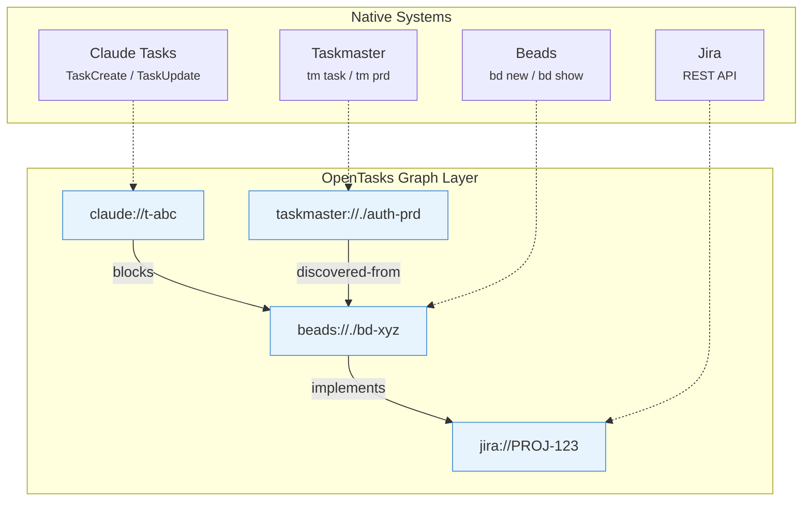
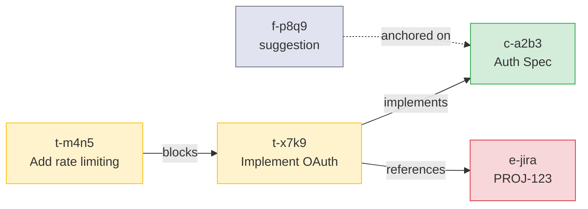
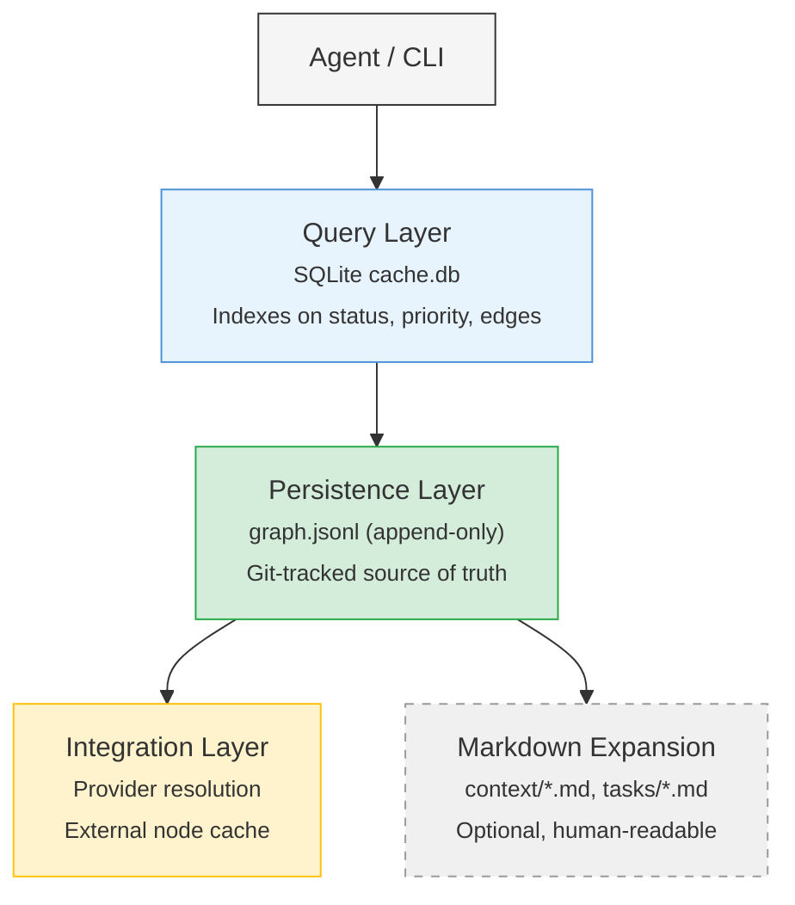
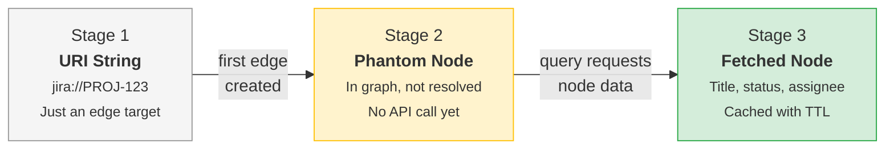
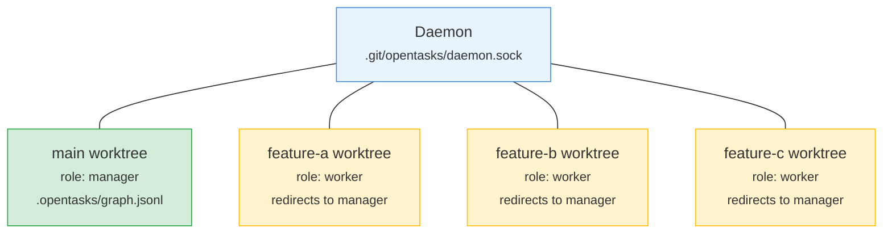

# OpenTasks

Cross-system graph for tasks and specs. Link Claude Tasks, Beads issues, and native tasks today — Jira, Linear, and other remote trackers are on the roadmap ([docs/STATUS.md](docs/STATUS.md)). Query blockers and ready work across all of them.

```
npm install opentasks
```

## Quick Start

OpenTasks runs as a small daemon that the CLI, the MCP server, and the client all
talk to over a Unix socket. **You don't manage it** — the first command that needs
it starts one automatically (opt out with `--no-autostart`).

### CLI

```bash
npm install -g opentasks            # or run any command below via `npx opentasks …`

opentasks init                                            # create .opentasks/ in your repo
opentasks create --type task --title "Wire up auth" --status open
opentasks create --type task --title "Add OAuth provider" --status open

opentasks ready                                           # unblocked tasks, ready to work on
opentasks list                                            # open tasks (closed hidden)
opentasks tree t-xxxx                                     # a task and its blocker tree
```

`ready` / `list` / `blocked` / `tree` are compact, token-light views. Linking
edges, claiming tasks with a lease, and arbitrary graph queries are each one more
subcommand — run `opentasks help`.

### MCP (Claude Code / agents)

Register the server once; the daemon auto-starts on first use:

```bash
claude mcp add opentasks -- npx opentasks mcp --scope all
```

…or in `.mcp.json`:

```json
{
  "mcpServers": {
    "opentasks": { "command": "npx", "args": ["opentasks", "mcp", "--scope", "all"] }
  }
}
```

Scopes are `tasks` (default), `graph`, `annotate`, `context`, `attempts`; `--scope all`
enables everything. The agent gets `create_task`, `claim_task`, `query`, `events_since`,
and the rest.

### Programmatic (embedders)

```typescript
import { createClient } from 'opentasks'

const client = createClient({ autoConnect: true })

// What's ready to work on?
const ready = await client.query({ ready: {} })

// Connect a task to an external reference
await client.link({ fromId: 't-x7k9', toId: 'beads://./bd-xyz', type: 'blocks' })

// What blocks this task (full chain)?
const blockers = await client.query({ blockers: { nodeId: 't-x7k9', transitive: true } })

await client.disconnect()
```

> The top-level `link`/`query`/`annotate` exports are the lower-level forms that
> take a `GraphStore` as their first argument — see [Programmatic API](#programmatic-api)
> for daemon-free usage. The `client.*` methods above take params only and route
> through the daemon.

## The Problem

Claude Tasks, Beads, Jira, Linear, Taskmaster each manage their own content. None of them can express cross-system relationships. You cannot say "this Claude subtask implements that Beads issue" or "this Beads issue is blocked by that Jira ticket."

OpenTasks adds edges between them.



You keep using each system's native tools. OpenTasks owns the graph.

## Three Tools

*Examples below use the bare tool form for brevity. Through a daemon, call them
as `client.link(...)` / `client.query(...)` / `client.annotate(...)` (params only);
the top-level `link`/`query`/`annotate` functions take a `GraphStore` first arg.*

### link()

Create or remove edges between any nodes.

```typescript
await link({ fromId: 't-x7k9', toId: 'c-a2b3', type: 'implements' })
await link({ fromId: 't-setup', toId: 't-impl', type: 'blocks' })
await link({ fromId: 't-setup', toId: 't-impl', type: 'blocks', remove: true })
```

Edge types: `blocks` (cycle-checked), `implements`, `references`, `related`, `parent-of`, `child-of`, `depends-on`, `discovered-from`, `duplicates`, `supersedes`, `verifies`, `reproduces`. Add custom types as strings.

### query()

Search nodes, edges, and computed views.

```typescript
await query({ ready: {} })                                        // Unblocked open tasks
await query({ blockers: { nodeId: 't-impl' } })                  // Direct blockers
await query({ blockers: { nodeId: 't-impl', transitive: true }}) // Full blocker chain
await query({ nodes: { type: 'task', status: 'open' } })        // Filter nodes
await query({ feedback: { nodeId: 'c-auth' } })                  // Feedback on a context
```

### annotate()

Feedback with anchoring, threading, and resolution.

```typescript
// Comment anchored to a line
await annotate({
  targetId: 'c-spec',
  create: {
    content: 'Consider rate limiting here',
    type: 'suggestion',
    anchor: { line: 42 },
  },
})

// Resolve feedback
await annotate({ targetId: 'c-spec', resolve: 'f-c4d5' })
```

Types: `comment`, `suggestion`, `request`. Each can be resolved, dismissed, or reopened.

## Nodes

Five types, all stored in `.opentasks/graph.jsonl`:

| Type | Prefix | Purpose |
|------|--------|---------|
| Context | c- | Requirements, specs, user intent (inline or file-backed) |
| Task | t- | Actionable work with status (open / in_progress / blocked / closed) |
| Feedback | f- | Anchored comments on nodes, with threading |
| ExternalNode | e- | References to Beads — and (planned) Jira, Linear, GitHub |
| Attempt | a- | Records of work attempts, with `verifies` / `reproduces` edges |

Edges carry an `x-` prefix.

A typical feature graph looks like this:



External nodes start as bare URIs. When you query them, OpenTasks fetches the data from the provider and caches it locally.

## Context Sources

Context nodes support multiple content source types. **Inline** contexts store content directly. **File-backed** contexts are lightweight pointers to codebase files — content is resolved on access with git-based drift detection.

```typescript
// Inline context — content stored in the node
const spec = await client.createNode({
  type: 'context',
  title: 'OAuth2 for API',
  content: '## Requirements\n- Google OAuth2 with PKCE\n...',
})

// File-backed context — pointer only, content resolved on demand
const fileCtx = await client.createContextFile({
  filePath: 'docs/auth-architecture.md',
  tags: ['auth'],
})
// → { id: 'c-x7k9', metadata: { context_file: true, context_file_path: '...', context_file_commit: 'abc123', ... } }

// Resolve content from the working tree (includes drift detection)
const resolved = await client.resolveContextFile('c-x7k9')
// → { content: '# Auth Architecture\n...', drifted: true, commit: 'def456', ... }

// Re-pin to current HEAD after changes
await client.syncContextFile('c-x7k9')
```

Via MCP (`--scope context`):

```json
// Create file-backed context
{ "tool": "create_context", "source": { "type": "file", "path": "docs/auth-architecture.md" } }

// Get with resolved file content
{ "tool": "get_context", "id": "c-x7k9", "resolve": true }

// Sync to current HEAD
{ "tool": "update_context", "id": "c-x7k9", "sync": true }

// Batch drift check
{ "tool": "list_contexts", "filesOnly": true, "checkDrift": true }
```

File-backed contexts never duplicate file content into the graph store. They record a content hash and git commit SHA at capture time, then detect drift by comparing the current file against that snapshot.

## MCP Server

Expose the full tool interface via [Model Context Protocol](https://modelcontextprotocol.io):

```bash
opentasks mcp --scope tasks,graph,annotate,context,attempts
```

Register with Claude Code (the MCP server auto-starts the daemon on first use):

```bash
claude mcp add opentasks -- npx opentasks mcp --scope all
```

22 tools across 5 scopes: `tasks` (CRUD + lifecycle + atomic claiming: `claim_task`, `claim_next`, `release_task`, `renew_claim`), `graph` (edges, queries, context summary, `events_since` change polling), `annotate` (feedback), `context` (context CRUD with file/snippet/inline sources), `attempts` (`record_attempt`, `list_attempts` with `verifies` edges).

## Programmatic API

For direct graph manipulation without the daemon. `createStoreForLocation` wires
the SQLite cache and JSONL persister for a `.opentasks/` directory and initializes
the store:

```typescript
import { createStoreForLocation } from 'opentasks'

const store = await createStoreForLocation('.opentasks')

const spec = await store.createNode({
  type: 'context',
  title: 'OAuth2 authentication',
  content: 'Users authenticate via OAuth2 with PKCE...',
})

const task = await store.createNode({
  type: 'task',
  title: 'Implement OAuth2 flow',
  status: 'open',
})

await store.createEdge({
  from_id: task.id,
  to_id: spec.id,
  type: 'implements',
})

const ready = await store.query.ready()
const blockers = await store.query.blockers(task.id)

await store.close() // flush pending changes to graph.jsonl
```

## Client Library

Connects to a running daemon via Unix socket:

```typescript
import { createClient } from 'opentasks'

const client = createClient({ autoConnect: true })
await client.link({ fromId: 't-x7k9', toId: 'c-a2b3', type: 'implements' })
const result = await client.query({ ready: {} })
await client.disconnect()
```

## Storage

```
.opentasks/
├── graph.jsonl       # Git-tracked source of truth (rewritten on flush)
├── tombstones.jsonl  # Soft deletes with configurable TTL
├── cache.db          # SQLite for fast queries (gitignored, rebuilt from JSONL)
├── config.json       # Location config, providers, retention
├── daemon.lock       # Exclusive lock (gitignored)
├── daemon.sock       # IPC socket (gitignored)
├── context/            # Optional markdown expansion
└── tasks/           # Optional markdown expansion
```



JSONL is the source of truth (git-tracked). The daemon writes it as a full-file snapshot on a debounced flush (not literally append-only). SQLite is the query cache (gitignored, rebuilt on startup). Markdown is optional human-readable expansion.

## Providers

OpenTasks owns the graph. Providers own node content. Four patterns:

| Pattern | Use | Example |
|---------|-----|---------|
| Provider | Resolve URIs on demand | Jira, Linear, GitHub *(planned)* |
| Adapter | Delegate all CRUD to backend | Beads (`bd` CLI) |
| SyncTarget | Two-way sync | Sudocode |
| IPC Bridge | Federate across daemons | Global store (`~/.opentasks`) |

External nodes go through three stages:



No upfront API calls. References stay cheap until you need the data.

### Provider Caching & Reconciliation

Provider-backed nodes cache data locally but treat the provider as the source of truth. When `graph.jsonl` is git-synced across environments, cached data can diverge from the provider's current state.

OpenTasks reconciles automatically:
- On file watcher reload (git pull, branch switch) — re-fetches provider-backed nodes
- Positive-writes-only — never deletes or archives nodes when a provider is unavailable
- Edge reconciliation — provider relationships extracted from node data, no extra API calls

Providers can opt into **pointer-only mode** (`materializeMode: 'pointer'`) where only the URI reference is stored and data is resolved transparently on every access.

See [docs/PROVIDER-RECONCILIATION.md](./docs/PROVIDER-RECONCILIATION.md) for the full design.

## Locations

Multiple `.opentasks/` directories at different filesystem levels. Each is isolated by default.

```
~/.opentasks/                         # Global store
  └── ~/projects/.opentasks/          # Workspace
      └── ~/projects/app/.opentasks/  # Project
```

Cross-location references use `opentasks://` URIs:

```
opentasks://./t-x7k9              # Current location
opentasks://~/t-a2b3              # User global
opentasks://../other-repo/c-c4d5  # Relative path
```

### Global Store

A shared store at `~/.opentasks/` you can use from any directory — handy for a
personal todo list that isn't tied to one repo. Commands are project-local by
default; pass `--global` (or set `OPENTASKS_GLOBAL=1`) to target the global store
instead.

```bash
# One-time setup
opentasks init --global

# Use from anywhere with --global (no per-project init needed)
cd /any/directory
opentasks create --type task --title "Read paper on transformers" --status open --global
opentasks ready --global
```

`--global` routes both the auto-started daemon and the client at `~/.opentasks/`,
so a task created from one directory is visible from any other. Without it, a
command operates on the project store it discovers: project `.opentasks/` > git
worktree > (fallback) global `~/.opentasks/`.

### Federation

A project can connect to the global store (or any other location) as a parent, enabling cross-scope references.

```bash
# In your project
opentasks init
opentasks connect ~/.opentasks --role parent
```

This auto-enables the global provider. You can then reference global tasks from your project using `global://` URIs:

```bash
# Create a cross-scope blocker
opentasks link --from i-local1 --to global://i-global1 --type blocks

# Query local tasks (default — global tasks excluded)
opentasks query '{"ready": {}}'

# Query global tasks explicitly
opentasks query '{"ready": {"providers": ["global"]}}'
```

Cross-scope blockers work transparently. If a local task is blocked by `global://i-xyz`, the `ready()` query resolves the global blocker via IPC, checks its status, and only shows the local task as ready once the global blocker is closed.

Federation config in `.opentasks/config.json`:

```json
{
  "providers": {
    "global": {
      "enabled": true,
      "path": "/Users/you/.opentasks",
      "timeout": 10000,
      "cacheTTL": 300000
    }
  }
}
```

## Worktrees

For agent swarms working across git worktrees:

```bash
opentasks worktree setup ./feature-a --branch feature-a --role worker --redirect-to .
opentasks worktree setup ./feature-b --branch feature-b --role worker --redirect-to .
```



One daemon serves all worktrees. Workers redirect reads and writes to the manager. Hash-based IDs prevent collisions across concurrent agents. A custom git merge driver handles branch merges of `graph.jsonl`.

```gitattributes
.opentasks/graph.jsonl merge=opentasks
```

## IDs

Hash-based, collision-resistant. Generated from UUID v4 through SHA256 and base36 encoding, with adaptive length based on entity count.

| Entity count | ID length | Example |
|-------------|-----------|---------|
| < 1,000 | 4 chars | t-x7k9 |
| < 6,000 | 5 chars | t-x7k9p |
| < 35,000 | 6 chars | t-x7k9pm |

## Git Sync

> For the full consistency model — durability tiers, flush↔pull serialization, graceful shutdown, and the multi-machine last-writer-wins caveat — see [docs/SYNC.md](docs/SYNC.md).

OpenTasks can auto-commit and auto-push `graph.jsonl` to a git remote. When enabled in `.opentasks/config.json`:

```json
{
  "sync": {
    "git": {
      "enabled": true,
      "autoCommit": true,
      "autoPush": true,
      "pushDebounceMs": 5000,
      "pullOnStartup": false
    }
  }
}
```

The daemon:
- **On startup** — installs the custom merge driver, optionally pulls from remote, starts auto-sync timer
- **On shutdown** — final commit+push if both flags are set
- **Continuously** — commits changes per `autoCommit`, pulls before push, respects debounce window

Four IPC methods are exposed for external control:

| Method | Purpose |
|--------|---------|
| `sync.now` | Runs the full cycle (commitIfDirty → pull → push). Returns `{ ran: false, reason }` if disabled. |
| `sync.pull` | Pulls only (used by external signal-driven convergence, e.g. OpenHive's MAP bridge). |
| `sync.status` | Returns `{ enabled, remote, autoCommit, autoPush, pullOnStartup, autoSyncRunning }`. |
| `sync.reload` | Re-reads `.opentasks/config.json` and hot-swaps the syncer. Lets external writers flip the flag without restart. |

Example usage:

```typescript
const status = await client.call('sync.status', {})
console.log(status)  // { enabled: true, remote: 'origin', autoCommit: true, autoPush: true, ... }

await client.call('sync.now', {})  // Manual sync
await client.call('sync.reload', {})  // Re-read config after external update
```

---

## MAP Integration

OpenTasks integrates with the [Multi-Agent Protocol (MAP)](https://github.com/multi-agent-protocol/multi-agent-protocol) for multi-agent coordination and observability. Two independent components:

### MAP Provider (Inbound)

Surfaces remote MAP tasks in the graph via `map://` URIs. Fully ephemeral — every operation is a direct RPC call to the MAP server, no local cache. When the connection is open, MAP tasks appear alongside native tasks. When it drops, they disappear cleanly.

```typescript
import { createMAPClient, createMAPProvider } from 'opentasks'

const result = await createMAPClient({ server: 'ws://localhost:8080', scope: 'my-team' });
if (result) {
  const provider = createMAPProvider({ client: result.client });
  // MAP tasks now queryable via provider registry
}
```

### MAP Event Bridge (Outbound)

Emits graph changes as MAP task events for external observability. Standalone and agent-owned — not tied to the daemon.

```typescript
import { createMAPEventBridge } from 'opentasks'

// Agent-side: emit your own actions
const bridge = createMAPEventBridge({ send: mySendFn, agentId: 'agent-alice' });
bridge.emitTaskCreated({ id: 'task-1', title: 'Do thing', status: 'open' });
bridge.emitTaskStatus('task-1', 'open', 'in_progress');

// Or share an existing MAP connection (e.g., with agent-inbox)
const bridge2 = createMAPEventBridge({
  connection: mapConnection,
  scope: 'swarm:my-team',
  agentId: 'agent-bob',
});
```

The bridge accepts either a raw `send` function or a shared `MAPConnection` object, so multiple systems can share one connection. See [PROVIDERS.md](./docs/PROVIDERS.md#map-provider) for full details.

## What This Is Not

OpenTasks is not a replacement for Claude Tasks, Beads, Jira, or any existing tool. It is not a unified CRUD API. It is not a project management tool. It is not an orchestration platform.

It adds the relationship layer these tools lack.

## Development

```bash
npm install
npm run build        # TypeScript compilation
npm test             # Unit tests
npm run test:slow    # Include slow tests
npm run test:e2e     # End-to-end tests
npm run test:all     # Everything
```

## Tech Stack

TypeScript 5.3+, better-sqlite3, graphology, chokidar, zod, proper-lockfile, Vitest.

Node >= 18 | MIT License | [github.com/alexngai/opentasks](https://github.com/alexngai/opentasks)
